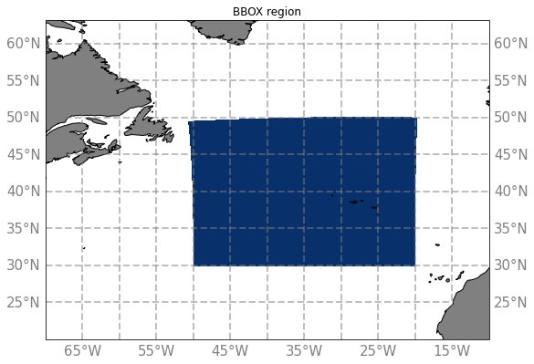

# Big Box region

The BBOX region corresponds to the blue area on this map :

BBOX region have been extracted from the simulations :
  - eNATL60-BLB002 :
    - [3D Horizontal Velocities](../items/BBOX60-BLB002-1h-UV-O-bottom.md)
