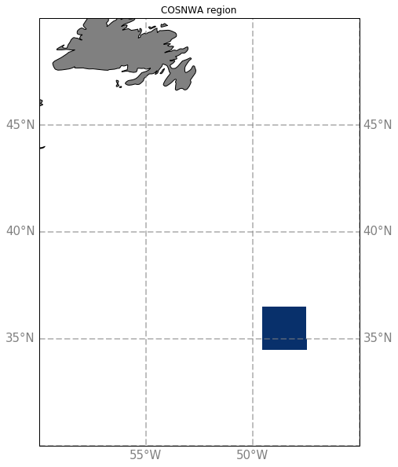

# North West Atlantic Swot Cross-Over

The COSNWA region corresponds to the blue area on this map :

COSNWAL region have been extracted from the simulations :
  - [eNATL60-BLB002](COSNWA-eNATL60-BLB002.md)
