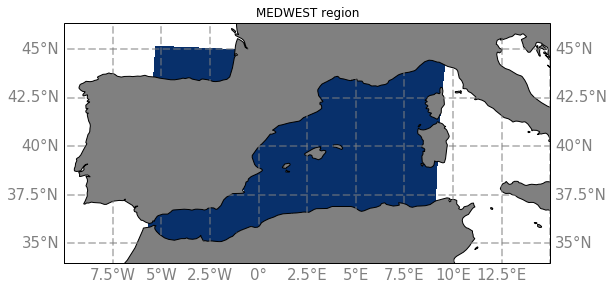

# Western Mediterranean

The MEDWEST region corresponds to the blue area on this map :

MEDWEST region have been extracted from the simulations :

- eNATL60-BLB002 :
  - [Hourly Surface fields](../items/MEDWEST60-BLB002-1h-SSH-SST-SSS-SSU-SSV.md) 
  - [Daily Surface fields](../items/MEDWEST60-BLB002-1d-SSH-SST-SSS-SSU-SSV.md) 
