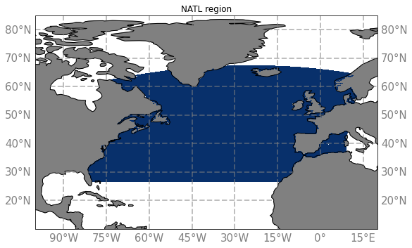

# North Atlantic

The NATL region corresponds to the blue area on this map :

NATL region have been extracted from the simulations :
  - NATL60-CJM165 :
    - [Hourly Sea Surface Height](../items/NATL60-CJM165-SSH-1h.md)
