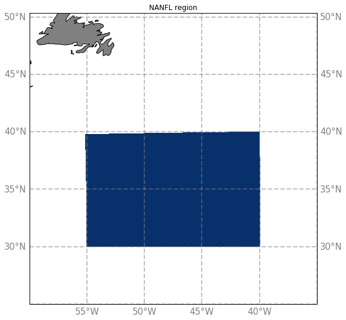

# Regions

## Global outputs :
## North Atlantic :

  - [North ATLantic config](NATL.md) 
  

  - [extened North ATLantic config](eNATL.md)
  

  - [Labrador Sea](LAB.md)
  - [Acores](ACO.md)
  
  - [New Found Land](NANFL.md)
  

  - [Western North Atlantic Swot Cross-Over](COSNWA.md)
  

## Mediterannean :

  - [Western Mediterranean](MEDWEST.md)

  - [Baleares Sea](MEDBAL.md)

