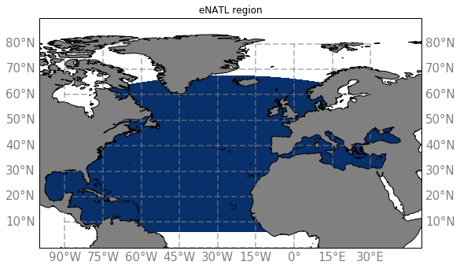

# Regions

- Global outputs :
- North Atlantic :

  - [NATL config](NATL.md)
  

  - [eNATL config](eNATL.md)
  

  - [Labrador Sea](LAB.md)
  - [Acores](ACO.md)
- Mediterannean :
  - [Western Mediterranean](MEDWEST.md)
