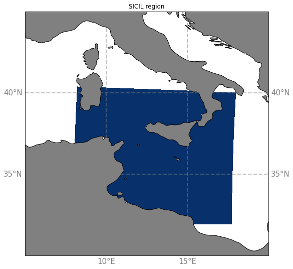

# Sicil region

The SICIL region corresponds to the blue area on this map :

SICIL region have been extracted from the simulations :
  - eNATL60-BLBT02 :
  - eNATL60-BLB002 :
     - [3D TSUVW](../items/SICIL60-BLB002-1h-TSUVW-O-bottom.md) 
