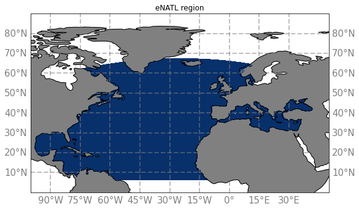

# extended North Atlantic

The eNATL region corresponds to the blue area on this map :

eNATL region have been extracted from the simulations :
  - [eNATL60-BLBT02](eNATL-eNATL60-BLBT02.md)
  - [eNATL60-BLB002](eNATL-eNATL60-BLB002.md)
