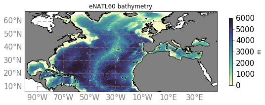

# eNATL60

- Bathymetry :

- Informations on the configuration : https://github.com/ocean-next/eNATL60/blob/master/02_experiment-setup.md

- Simulations conducted with this configuration :
  - [eNATL60-BLBT02](eNATL60-BLBT02.md)
  - [eNATL60-BLB002](eNATL60-BLB002.md)

- [Grid description files](../items/eNATL60-grid-files.md)
