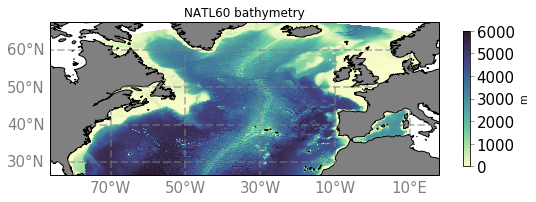

# NATL60

- Informations on the configuration : 

- Bathymetry :

- Simulations conducted with this configuration :
  - [NATL60-CJM165](natl60-cjm165.md)

- [Grid description files](../items/NATL60-grid-files.md)
